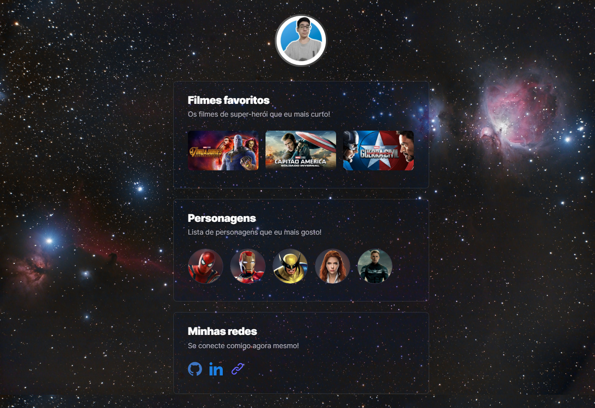

# nlw eSports

## Sobre
Projeto que desenvolvi junto com a rocketseat e com o Mayk Brito durante a Next Level Week (NLW).

> ## Expectativas
Eu estou gostando do evento, e ele é focado para quem nunca teve contato com a programação, porém, eu estou revisando e entendendo melhor alguns conceitos que não ficaram claros anteriormente, e no próximo, pretendo participar da outra trilha!

> ### Resultado

[🔗 Clique aqui para acessar](https://rodrigues14.github.io/nlw/)

## 🛠 Tecnologias

- HTML
- CSS
- GIT e GitHub

## 🚀 Contato

- [LinkedIn](https://www.linkedin.com/in/lucas-rodrigues-perfil/)
- [Portfólio](https://portfolio-lucasrodrigues.netlify.app/)
- lucascontatodev@gmail.com

## Como foi as aulas

> ### ✔ Stage 1/6 | Base Building
Foi apresentado o evento e falado sobre a metodologia adotada pela Rocketseat, além de abordar os fundamentos da programação e configurarmos o ambiente dev.

> ### ✔ Stage 2/6 | High speed
Foi explicado sobre a linguagem de marcação HTML e desenvolvido a base do projeto utilizando a mesma.

> ### ✔ Stage 3/6 | To be continued
Durante essa aula, teve a explicação do que é o CSS e como estilizar uma página, e foi criado o estilo do projeto.

> ### ✔ Stage 4/6 | Power up
Nesta aula, foi falado um pouco mais sobre as competencias de um dev além do código, as soft skills e finalizamos o estilo do projeto, trabalhando com keyframes para adicionar transições nos elementos.

> ### Stage 5/6 | Final Round
Durante esta aula, foi falado um pouco mais do github e sobre o github pages. Além disso o professor falou sobre como montar um bom readme para documentar os nossos projetos.

> ### Stage 6/6 | The Next Level
Em breve
